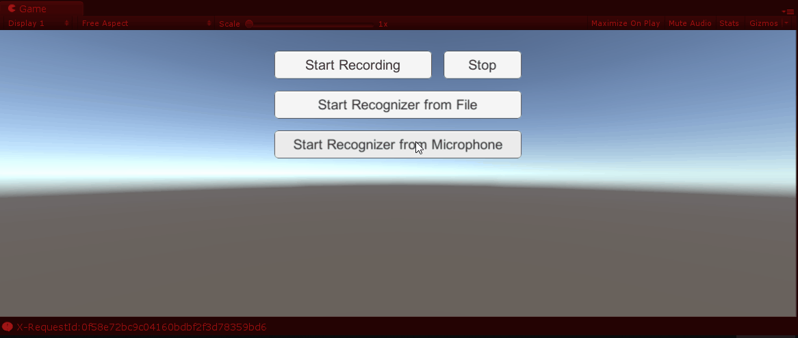

# Unity-MS-SpeechSDK
Sample Unity project used to demonstrate Speech Recognition (aka Speech-to-Text) using the new [Microsoft Speech Service](https://docs.microsoft.com/en-us/azure/cognitive-services/Speech-Service/) (currently in Preview) via WebSockets. The Microsoft Speech Service is part of [Microsoft Azure Cognitive Services](https://www.microsoft.com/cognitive-services). **This is a work in progress**. 

* **Unity version:** 2018.2.5f1
* **Speech Service version:** 0.6.0 (Preview)
* **Target platforms tested:** Unity Editor/Mono, Windows Desktop x64, Android, UWP (*to be tested*: iOS)

## Implementation Notes
* This sample uses the [Speech Service WebSocket protocol](https://docs.microsoft.com/en-us/azure/cognitive-services/speech/api-reference-rest/websocketprotocol) to interact with the Speech Service and generate speech recognition hypotheses in real-time.
* This sample is compatible with both the new Cognitive Services Speech Service (Preview) and the classic Bing Speech API. The default and recommended approach is the new service.
* You will need an Azure Cognitive Services account to use this sample: [Create an account here](https://docs.microsoft.com/azure/cognitive-services/cognitive-services-apis-create-account).
* If you see any API keys in the code, these are either trial keys that will expire soon or temporary keys that may get invalidated. Please get your own keys. [Get your own trial key to Bing Speech or the new Speech Service here](https://azure.microsoft.com/try/cognitive-services). A free tier is available allowing 5,000 transactions per month, at a rate of 20 per minute.
* This sample supports two methods to perform speech recognition:
* **METHOD #1**: The UI Canvas button **Start Recognizer from File** uploads a speech audio file to perform the recognition. You can use the buttons **Start Recording** & **Stop** to first record an audio file. The sample uses the same audio file for recording and recognition upload by default.
* **METHOD #2**: The UI Canvas button **Start Recognition from Microphone** uses the *default* microphone to record the user's voice and send audio packets for real-time recognition. The service automatically detects silences and issues an end of speech event to stop the microphone recording automatically.
* The speech recognition results are posted in the UI Canvas Text label as well as the Unity Debug Console window in real-time as the paudio packets are received by the Speech service.
* The **SpeechManager** also includes support for client-side silence detection, which has configurable parameters. Thanks to my colleague [Jared Bienz](https://github.com/jbienzms) for this feature.
* *NOTE: This project contains incomplete artifacts in progress*.

## Resource Links
* [Microsoft Cognitive Services](https://www.microsoft.com/cognitive-services) (formerly Project Oxford)
* [New Cognitive Services Speech Service](https://docs.microsoft.com/en-us/azure/cognitive-services/Speech-Service/) (currently in Preview)
* [Classic Bing Speech Service](https://docs.microsoft.com/en-us/azure/cognitive-services/Speech/home) (legacy)
* [Unity Speech Synthesis Sample](https://github.com/ActiveNick/Unity-Text-to-Speech) (aka Text-to-Speech)

## Follow Me
* Twitter: [@ActiveNick](http://twitter.com/ActiveNick)
* Blog: [AgeofMobility.com](http://AgeofMobility.com)
* SlideShare: [http://www.slideshare.net/ActiveNick](http://www.slideshare.net/ActiveNick)
